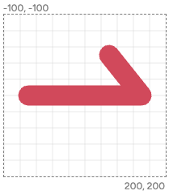

# class

## 使用 class 定义样式

### 使用样式属性定义样式

我们之前很多时候都会这样写样式: 直接当成属性定义在标签上，比如`fill`、`stroke`、`stroke-width`等等。

```html
<rect
  x="10"
  y="10"
  width="20"
  height="20"
  fill="brown"
  stroke="red"
  stroke-width="2px"
/>
```

### 使用 style 属性定义样式

```html
<circle
  cx="100"
  cy="100"
  r="80"
  style="fill: red; stroke: black; stroke-width: 5;"
/>
```

如果是在react项目中，要采用style对象的写法

```html
<circle cx="100" cy="100" r="80" style={{ fill: 'red', stroke: 'black',strokeWidth:'5' }} />
```

> 接下来我们尝试用 class 来定义样式吧

### 在 svg 内部，把所有的 class 都写在 style 标签内

```html
<html lang="en">
  <body>
    <svg
      width="120"
      height="220"
      viewBox="0 0 120 120"
      version="1.1"
      xmlns="http://www.w3.org/2000/svg"
    >
      <style>
        .rectClass {
          stroke: #000066;
          fill: #00cc00;
        }
        .circleClass {
          stroke: #006600;
          fill: #cc0000;
        }
      </style>

      <rect class="rectClass" x="10" y="10" width="100" height="100" />
      <circle class="circleClass" cx="40" cy="50" r="26" />
    </svg>
  </body>
</html>
```

### 外联 css 文件，常在实际项目中引用

```html
<svg width="200" height="200" viewBox="-100 -100 200 200">
  <circle class="head" cx="0" cy="-50" r="30" />
</svg>
```

```css
.head {
  fill: #cd803d;
}
```

#### demo

查看代码地址：**/app/examples/GingerBread/index.jsx**
[[姜饼]](../app/examples/GingerBread/index.jsx)

## 常用class

### fill

### stroke

### stroke-width

### stroke-linecap
定义 线段两端的形状（如开放路径的起点和终点）。

### stroke-linejoin

和stroke-linecap很像，定义两条线段在拐角处（如多边形顶点） 的连接方式

- -miter 默认值，尖角 两条线延长相交，形成尖角；但过尖可能被截断
- -round 圆角 拐角处呈圆滑连接
- -bevel 斜角/截角 拐角处直接被切平

```html
<svg width="200" height="200" viewBox="-100 -100 200 200">
  <path
    d="
        M -70 0
        L 70 0
        L 30 -50"
    fill="none"
    stroke="#D1495B"
    stroke-width="25"
    stroke-linecap="round"
    stroke-linejoin="round"
  />
</svg>
```

让们来看看有这个属性，转折处是圆滑的，如下：


没有这个属性就是直接转折，如下：

