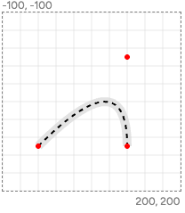
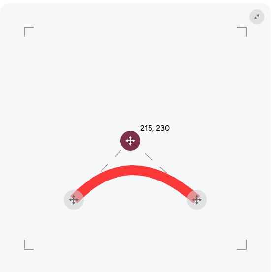
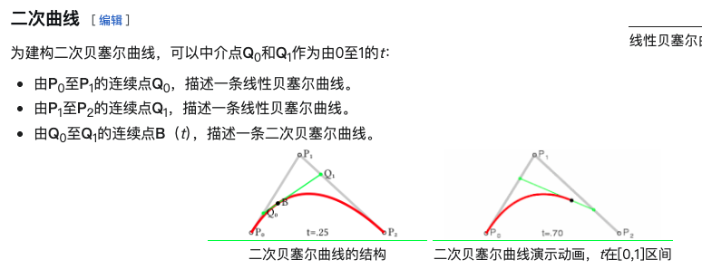

# Path

你是否注意到我们下载下来的svg文件中，都含有大量的path标签

- -用于绘制组合线条、弧线、曲线等填充或非填充的高级形状
- -path功能非常强大，较难掌握

## 属性d

我们使用d来绘制图形，我们可以设置很多组命令。每一组命令都是由一个代表命令类型的字母开始，以一个坐标结束
比如 `d="M 0,0"`

\*\* 注意
SVG 的路径语法很宽松 —— 只要数值之间用空格或逗号分隔即可，坐标之间也可以省略逗号。
但建议统一风格，推荐使用标准空格分隔的写法，或者如果你在代码中拼接字符串，也可以使用逗号，特别是结合模板语法时会更清晰。

## 指令

### M:move-to

画笔移动指针到某个点，但是并不绘制任何东西，可以理解为定义一个点的位置。

比如`M 0,0`就代表画笔移动到这个这个坐标位置，然后我们接下来要做点什么

### L:line-to

从前一个点开始绘制一条直线，这个指令总是从前一个指令开始，通常从move-to指令开始

比如`M 0,0 L 20,20`就代表画笔从[0,0]点开始，向[20,20]这个点绘制了一条直线

### Q: Quadratic Bezier Curves（二次贝塞尔曲线）

是一种用来绘制平滑曲线的路径命令，你必须先使用 M 命令（移动起点），然后才能使用 Q

指令：Q controlX controlY endX endY

controlX controlY 是控制点的坐标（用于弯曲方向）、endX endY 是曲线的终点坐标

比如`Q 40,-50 40,50`就代表控制点是[40,-50]点开始，向[40,50]这个点绘制了一平滑的曲线

```
<svg
  width="200"
  height="200"
  viewBox="-100 -100 200 200"
>
  <path
    d="
      M -60,50
      Q 40,-50 40,50"
    fill="none"
    stroke="black"
    stroke-width="10"
  />
</svg>
```



我们来看一下二次贝塞尔曲线的控制点在哪里


> 二次贝塞尔曲线是什么？
> 

### C: Cubic Bezier Curves（三次贝塞尔曲线）

是比二次贝塞尔曲线更强大、更灵活的曲线绘制方式。它使用两个控制点和一个终点，生成一条从起点到终点的平滑曲线。
你必须先使用 M 命令（移动起点），然后才能使用 Q。

指令：C controlX1 controlY1 controlX2 controlY2 endX endY

(controlX1, controlY1)：第一个控制点，控制起点切线方向、(controlX2, controlY2)：第二个控制点，控制终点切线方向、(endX, endY)：终点坐标

```
<svg width="450" height="450">
  <path
    d="M 100 350 C 70 100 380 100 350 350"
    stroke="#fa3838" stroke-width="20" fill="none"
  />
</svg>
```

> 三次贝塞尔曲线
> [[贝塞尔曲线]](https://zh.wikipedia.org/wiki/%E8%B2%9D%E8%8C%B2%E6%9B%B2%E7%B7%9A)

### Z：（close path）

从当前点直接连接回路径的起点（M 或 m 命令定义的点）

Z 和 z 效果相同；执行后，当前点仍停留在闭合前的最后一个点（非起点）
